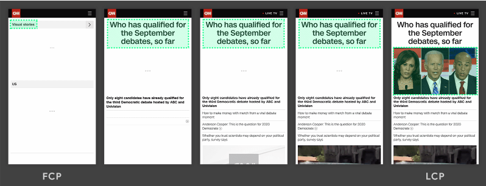

# Largest Contentful Paint (LCP)

## 什么是 LCP

  > 网页主要内容的加载速度
  > 视口内可见的最大图片或文本块的呈现时间（相对于用户首次导航到页面的时间）。

  > 良好的用户体验 `lcp` 应该控制在 *2.5* 秒以内

  

  LCP 会考虑的元素包括：

  - `` 元素
  - `<svg>` 元素内的 `<image>` 元素
  - 包含海报图片的 `<video>` 元素（使用海报图片加载时间）
  - 使用通过 url() 函数（而不是 CSS 渐变）加载背景图片的元素
  - 块级元素，包含文本节点或其他内嵌级文本元素子项。
  - 为自动播放 `<video>` 元素而绘制的第一帧
  - 动画图片格式（例如 GIF 动画）的第一帧


## 与FCP 的区别

    FCP 用于衡量何时将任何内容绘制到屏幕上；当绘制主要内容时，LCP 会测量，以便 LCP 具有更强的选择性。


## 在js中 测量 LCP

```js
const LCP_SUB_PARTS = [
  'Time to first byte',
  'Resource load delay',
  'Resource load time',
  'Element render delay',
];

new PerformanceObserver((list) => {
  const lcpEntry = list.getEntries().at(-1);
  const navEntry = performance.getEntriesByType('navigation')[0];
  const lcpResEntry = performance
    .getEntriesByType('resource')
    .filter((e) => e.name === lcpEntry.url)[0];

  // Ignore LCP entries that aren't images to reduce DevTools noise.
  // Comment this line out if you want to include text entries.
  if (!lcpEntry.url) return;

  // Compute the start and end times of each LCP sub-part.
  // WARNING! If your LCP resource is loaded cross-origin, make sure to add
  // the `Timing-Allow-Origin` (TAO) header to get the most accurate results.
  const ttfb = navEntry.responseStart;
  const lcpRequestStart = Math.max(
    ttfb,
    // Prefer `requestStart` (if TOA is set), otherwise use `startTime`.
    lcpResEntry ? lcpResEntry.requestStart || lcpResEntry.startTime : 0
  );
  const lcpResponseEnd = Math.max(
    lcpRequestStart,
    lcpResEntry ? lcpResEntry.responseEnd : 0
  );
  const lcpRenderTime = Math.max(
    lcpResponseEnd,
    // Use LCP startTime (which is the final LCP time) as sometimes
    // slight differences between loadTime/renderTime and startTime
    // due to rounding precision.
    lcpEntry ? lcpEntry.startTime : 0
  );

  // Clear previous measures before making new ones.
  // Note: due to a bug this does not work in Chrome DevTools.
  LCP_SUB_PARTS.forEach((part) => performance.clearMeasures(part));

  // Create measures for each LCP sub-part for easier
  // visualization in the Chrome DevTools Performance panel.
  const lcpSubPartMeasures = [
    performance.measure(LCP_SUB_PARTS[0], {
      start: 0,
      end: ttfb,
    }),
    performance.measure(LCP_SUB_PARTS[1], {
      start: ttfb,
      end: lcpRequestStart,
    }),
    performance.measure(LCP_SUB_PARTS[2], {
      start: lcpRequestStart,
      end: lcpResponseEnd,
    }),
    performance.measure(LCP_SUB_PARTS[3], {
      start: lcpResponseEnd,
      end: lcpRenderTime,
    }),
  ];

  // Log helpful debug information to the console.
  console.log('LCP value: ', lcpRenderTime);
  console.log('LCP element: ', lcpEntry.element, lcpEntry.url);
  console.table(
    lcpSubPartMeasures.map((measure) => ({
      'LCP sub-part': measure.name,
      'Time (ms)': measure.duration,
      '% of LCP': `${
        Math.round((1000 * measure.duration) / lcpRenderTime) / 10
      }%`,
    }))
  );
}).observe({type: 'largest-contentful-paint', buffered: true});
```

或者使用： web-vitals 库

```JS
    import {onLCP} from 'web-vitals';

    // Measure and log LCP as soon as it's available.
    onLCP(console.log);
```

## 如何提高LCP

<!-- https://web.dev/articles/optimize-lcp?hl=zh-cn -->

  - LCP 资源尽早开始加载
    1. 通过 `<link rel="preload">`（或通过 Link 标头）预加载的。
    2. fetchpriority 属性提示浏览器哪些资源最重要，从而指定较高的优先级可以提高哪些资源的优先级
      ```HTML
         
        <!-- 轮播图的其他图片 -->
         
      ```
  - 消除元素渲染延迟

    LCP 元素无法在其资源加载完毕后立即呈现的主要原因是，呈现因其他原因而遭到阻塞：
    - 由于 <head> 中的样式表或同步脚本仍在加载，系统阻止呈现整个网页。
    - LCP 资源已加载完毕，但 LCP 元素尚未添加到 DOM 中（正在等待一些 JavaScript 代码加载完毕）。
    - 相应元素被其他一些代码（如仍在确定用户应参与的实验的 A/B 测试库）隐藏了。
    - 主线程因耗时较长的任务而阻塞，渲染工作需要等待这些耗时较长的任务完成。

    优化：

    - 移除未使用的 CSS
    - 推迟非关键 CSS
    - 缩减资源的大小（压缩图片、提供最佳图片大小等）
    - 缩短资源需要的行程距离（CDN）
    - 减少网络带宽争用（为 LCP 资源指定了 high fetchpriority ）


    概括来讲，优化 LCP 可以总结为 4 个步骤：

        确保 LCP 资源尽早开始加载。
        确保 LCP 元素可在其资源完成加载后立即渲染。
        在不牺牲质量的情况下，尽可能缩短 LCP 资源的加载时间。
        尽快提供初始 HTML 文档。