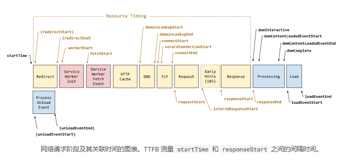
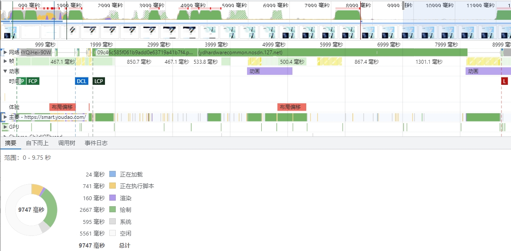
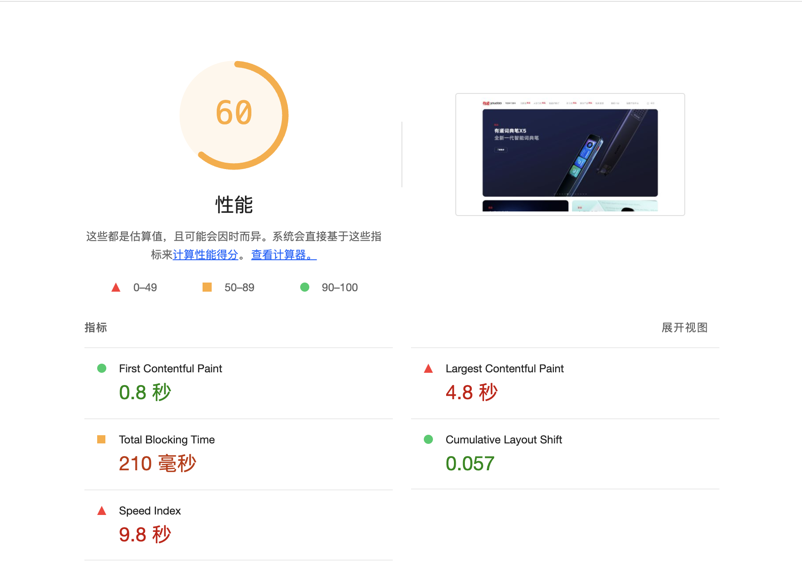
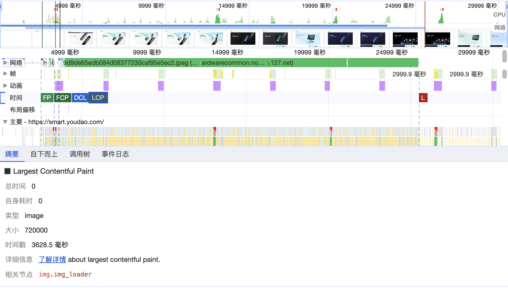
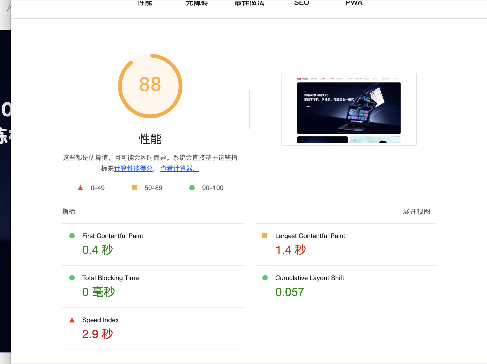

# performance

W3C标准化 引入了 `Navigation Timing API` ，实现了自动、精准的页面性能打点；开发者可以通过 `window.performance` 属性获取。


## PerformanceTiming

   Level 1 规范

   > 已弃用: 不再推荐使用该特性。虽然一些浏览器仍然支持它，但也许已从相关的 web 标准中移除，也许正准备移除或出于兼容性而保留。请尽量不要使用该特性，并更新现有的代码；该特性随时可能无法正常工作。


## PerformanceNavigationTiming

  Level2 而提供了更为精准、更为全面的新的性能统计API-PerformanceNavigationTiming。

  

  


  通过 PerformanceObserver监听资源

  ```JS
  // ttfb
  new PerformanceObserver((entryList) => {
    const [pageNav] = entryList.getEntriesByType('navigation');

    console.log(`TTFB: ${pageNav.responseStart}`);
  }).observe({
    type: 'resource',
    buffered: true
  });
  
  ```

## 优化前

lighthouse 







## 优化后





## 优化点

1. 优化图片

  - 选择合适尺寸

    例如 100x100 (CSS)像素显示的照片

    | 屏幕分辨率(dpr) | 总像素数 | 未压缩的文件大小（每个像素 4 字节） |
    | :-----| ----: | :----: |
    | 1 倍  | 100 x 100 = 10000 | 40000 字节 |
    | 2 倍 | 100 x 100 x 4 = 40,000	 | 160000 字节 |
    | 3 倍 | 100 x 100 x 9 = 90000	 | 360000 字节 |

    提供自适应图片：

    1. 通过 img srcset 和 sizes
    2. picture source

  - 转换为 WebP 格式

    如果支持webp则：

    WebP 图片比对应的 JPEG 和 PNG 图片小，文件大小通常可缩减 25-35%。这会缩减页面大小并提升性能。

    判断支持的方法：

    1. `<picture> <source type="image/webp" srcset="flower.webp"> ...`
    2. canvas

  - 图片 CDN 优化

  - LCP 图片元素使用 fetchpriority 属性值 "high"，以便浏览器可以尽快开始加载该图片
  
  - 如果图片无法在初始 HTML 中立即发现，请考虑为 LCP 候选图片使用 rel=preload 提示，以便浏览器提前加载该图片。

  - 延迟加载图片 

    - loading lazy
    - Intersection Observer

  - 尽早建立网络连接

2. 尽早建立网络连接

   浏览器必须先建立连接，然后才能从服务器请求资源。建立安全连接包括以下三个步骤：

   1. 查找域名并将其解析为 IP 地址。

   2. 设置与服务器的连接。

   3. 对连接进行加密以确保安全。

   在每一个步骤中，浏览器都会向服务器发送一段数据，然后服务器会发回响应。从出发地到目的地再往回的旅程称为“往返”。

   根据网络状况，单次往返可能会花费大量时间。连接设置过程可能涉及最多三次往返，如果未优化，则更多次。

  - rel=preconnect (DNS、TCP 握手、TLS 协商等)

  - rel=dns-prefetch 

3. css

  - 压缩
  - 推迟非关键的

4. 高效加载第三方 JavaScript

  - 在 `<script>` 标记中使用 async 或 defer 属性
  - 尽早建立与所需来源的连接
  - 延迟加载

5. 字体优化